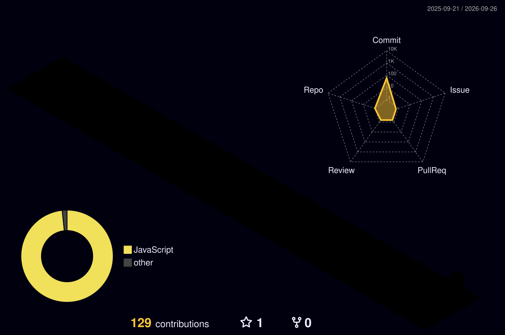

#  Hi, i'm Nicolas Scheidt!

### 📑 About Me
- 💻 Junior Fullstack Developer at <a href="https://www.zrobank.com.br/en">Z.ro Bank</a>.
- 📚 UNIFBV Wyden Computer Science (C.S.) undergraduate. (8/10)
- 👨‍💻 I'm currently learning technologies and developing skills for my career as a developer.
- 🎮 In my free time, i like playing videogames and watching sports (Fun fact: I support Sport Recife! 🦁).

#

<h3 align="center">🚀💻 Technologies & Tools</h3>

<h4 align="center">📋 Languages</h4>
                                       

 
  
 

 

 
 

<h4 align="center">📚 Frameworks, Plataforms and Libraries</h4>

 
 
 

  

<h4 align="center"> 🎨 Design</h4> 

  

#

<h3 align="center"> ⚡ GitHub Stats</h3>

 

  

  

